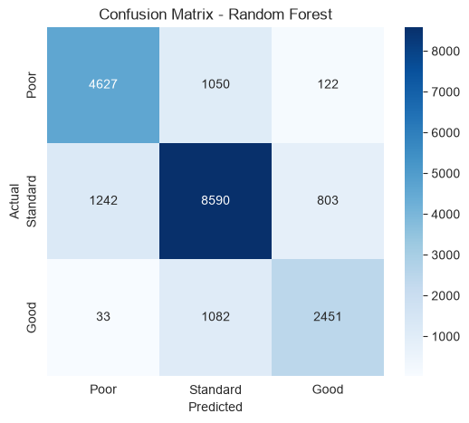
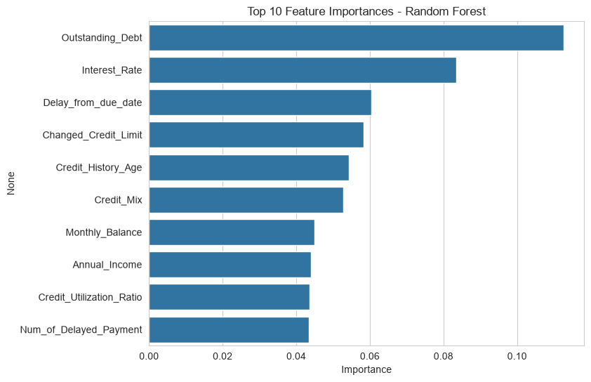

# Task 1: Credit Scoring Model

## CodeAlpha Machine Learning Internship

## Objective

Predict an individual's creditworthiness (Poor / Standard / Good) using financial and behavioral data.

## Dataset

[Credit Score Classification](https://www.kaggle.com/datasets/parisrohan/credit-score-classification) — 100,000 records, 28 raw features covering income, debt, payment history, and credit behavior.

## Approach

1. Data cleaning: fixed mixed-type columns, removed invalid values, parsed text fields into numeric form.
2. Handled missing values (median for numeric, mode for categorical).
3. Label-encoded categorical features and the target variable.
4. Trained and compared three classifiers: Logistic Regression, Decision Tree, and Random Forest.

## Results

| Model | Accuracy | F1 (weighted) |
| --- | --- | --- |
| Logistic Regression | 61% | 0.59 |
| Decision Tree | 68% | 0.68 |
| **Random Forest** | **78%** | **0.78** |

**Best model: Random Forest** — ROC-AUC: 0.9074

### Confusion Matrix

### Feature Importance

## Key Insight

Outstanding debt, interest rate, and payment delays were the strongest predictors of credit score — consistent with real-world credit risk assessment.

## Tech Stack

Python, Pandas, Scikit-learn, Matplotlib, Seaborn
