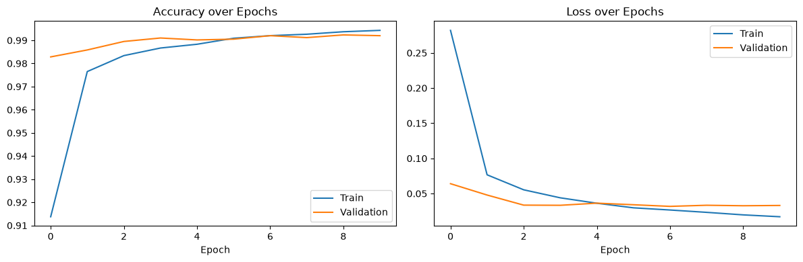
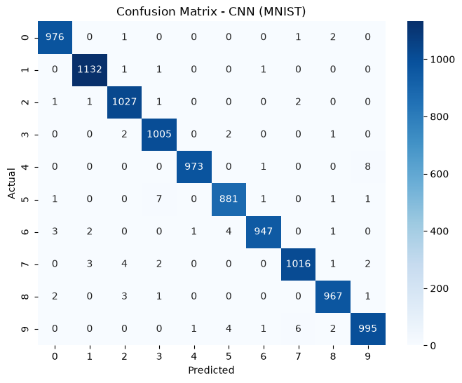
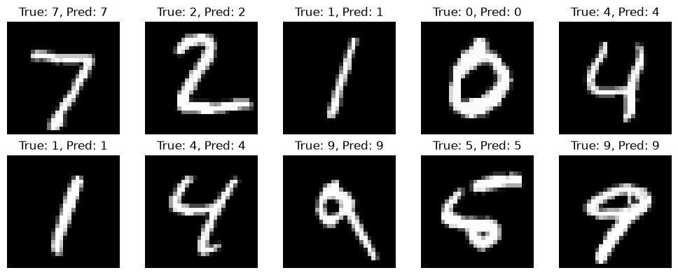

# Task 3: Handwritten Character Recognition

## CodeAlpha Machine Learning Internship

## Objective

Recognize handwritten digits (0-9) from images using deep learning.

## Dataset

[MNIST](http://yann.lecun.com/exdb/mnist/) — 70,000 grayscale images (28x28 pixels) of handwritten digits (60,000 train / 10,000 test), loaded directly via `keras.datasets.mnist`.

## Approach

1. Normalized pixel values (0-255 → 0-1) and reshaped images for CNN input.
2. One-hot encoded labels for multi-class classification.
3. Built a CNN: 2 Conv2D + MaxPooling blocks for feature extraction, followed by Dense layers with Dropout for classification.
4. Trained for 10 epochs with a validation split to monitor overfitting.

## Model Architecture

- Conv2D(32) → MaxPooling2D
- Conv2D(64) → MaxPooling2D
- Flatten → Dense(128) → Dropout(0.3) → Dense(10, softmax)
- ~224K trainable parameters

## Results

**Test Accuracy: 99.19%** | **Test Loss: 0.0261**

All 10 digit classes achieved a 0.99 F1-score with no significant weak spots.

### Training Curves

### Confusion Matrix

### Sample Predictions

## Key Insight

The model's rare errors occur between visually similar digit pairs (e.g. 9 confused with 4 or 7), consistent with genuine handwriting ambiguity rather than random noise — training and validation accuracy tracked closely throughout, indicating no overfitting.

## Tech Stack

Python, TensorFlow/Keras, Scikit-learn, Matplotlib, Seaborn
